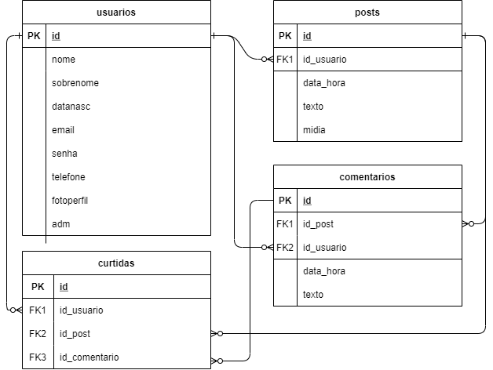

# Odin

Projeto Final do Curso Técnico Integrado de Desenvolvimento de Sistemas - Colégio Pedro II - Campus Duque de Caxias

**Integrantes:**
 - Erick Silva de Lima
 - Lucas Fernando Miranda de Luna do Carmo
 - Marcos Gabriel Serafim Teixeira

## Descrição do Projeto

Rede social dedicada a vendas e trocas que facilita o contato entre vendedor e comprador, de uma forma mais pessoal e menos burocrática.
Através de uma interface simples e semelhante a redes sociais comuns, o usuário se sentiria confortável para navegar em busca do produto ideal.
O público-alvo do projeto são pessoas com interesse em compartilhar produtos novos ou usados com uma comunidade apropriada para compra, venda ou troca.

## Documentação

- [Manual do Usuário](manual.md)
- [Requisitos](requisitos.md)
- [Casos de Uso](casos-de-uso.md)
- [Apresentação](apresentacao.pdf)

**Diagrama de Classes**

**Modelagem do Banco de Dados**

