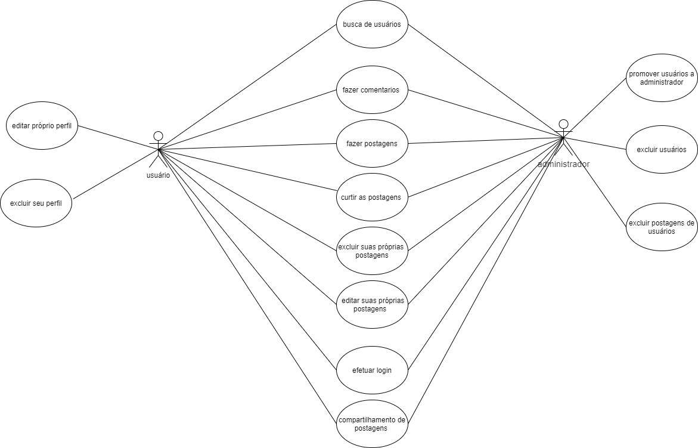

# Odin

Projeto Final do Curso Técnico Integrado de Desenvolvimento de Sistemas - Colégio Pedro II - Campus Duque de Caxias

**Integrantes:**
 - Erick Silva de Lima
 - Lucas Fernando Miranda de Luna do Carmo
 - Marcos Gabriel Serafim Teixeira

## Descrição do Projeto

Rede social dedicada a vendas e trocas que facilita o contato entre vendedor e comprador, de uma forma mais pessoal e menos burocrática.
Através de uma interface simples e semelhante a redes sociais comuns, o usuário se sentiria confortável para navegar em busca do produto ideal.
O público-alvo do projeto são pessoas com interesse em compartilhar produtos novos ou usados com uma comunidade apropriada para compra, venda ou troca.

## Versões utilizadas para desenvolvimento:

 - Apache 2.4.25
 - PHP 5.6.30
 - MySQL 5.7.17
 - PhpMyAdmin 4.7.0

## Informações de acesso a contas para teste de funcionalidades:

**Administrador**

 - E-mail: adm@gmail.com
 - Senha: adminroot

**Usuário comum**

 - E-mail: teste@gmail.com
 - Senha: teste123

## Documentação

- [Manual do Usuário](manual.md)
- [Requisitos](requisitos.md)
- [Casos de Uso](casos-de-uso.md)
- [Apresentação](Apresentação-Odin.pdf)

**Diagrama de Classes**

**Modelagem do Banco de Dados**

