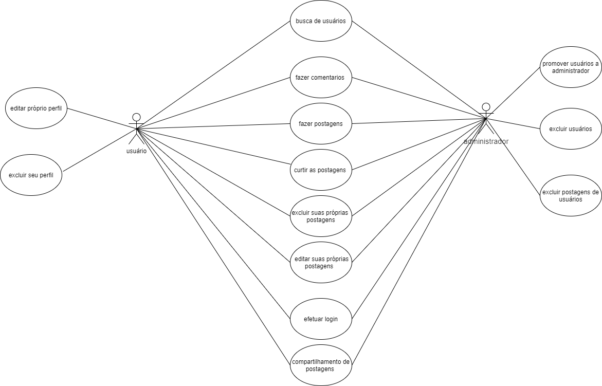

# Documento de Casos de Uso

## Lista dos Casos de Uso

 - [CDU 01](#CDU-01): Login
 - [CDU 02](#CDU-02): Logout
 - [CDU 03](#CDU-03): Cadastrar 
 - [CDU 04](#CDU-04): Editar usuário
 - [CDU 05](#CDU-05): Lista de usuários (dashboard do administrador)
 - [CDU 06](#CDU-06): Editar usuário(administrador)
 - [CDU 07](#CDU-07): Excluir usuário (administrador)
 - [CDU 08](#CDU-08): Sistema de busca por palavra chave
 - [CDU 09](#CDU-09): Criar postagens
 - [CDU 10](#CDU-10): Editar postagens
 - [CDU 11](#CDU-11): Excluir postagens
 - [CDU 12](#CDU-12): Timeline do usuário

## Lista dos Atores

 - Usuário 
 - Administrador

## Diagrama de Casos de Uso

## Descrição dos Casos de Uso

### CDU 01

Sistema de login

**Fluxo Principal**

1- O sistema apresenta um formulário e campos E-mail e senha. 
2- O usuário insere seu E-mail e senha e clica no botão “Entrar”. 
3- O sistema valida o E-mail e a senha do usuário. 
4- O sistema encaminha o usuário para sua tela inicial.

**Fluxo Alternativo A**

1- O sistema apresenta um formulário e campos E-mail e senha. 
2- O usuário insere seu E-mail e senha e clica no botão “Entrar”. 
3- O sistema informa que o E-mail está inválido. 
4- O usuário corrige as informações de E-mail e senha clica no botão “Entrar”.  
5- O sistema encaminha o usuário para sua tela inicial. 

**Fluxo Alternativo B**

1- O sistema apresenta um formulário e campos E-mail e senha. 
2- O usuário insere seu E-mail e Senha e clica no botão “Entrar”. 
3- O sistema informa que o Senha está inválido. 
4- O usuário corrige as informações de E-mail e senha clica no botão “Entrar”.  
5- O sistema encaminha o usuário para sua tela inicial.

**Fluxo Alternativo C**

1- O sistema apresenta um formulário e campos E-mail e senha. 
2- O usuário clica no botão “Entrar”. 
3- O sistema apresenta um popup pedindo para preencher os campos de E-mail e senha. 
4- O usuário insere seu E-mail e senha clica no botão “Entrar”.  
5- O sistema encaminha o usuário para sua tela inicial. 

**Fluxo Alternativo D**

1- O sistema apresenta um formulário e campos E-mail e senha. 
2- O usuário clica no botão “Cadastre-se”. 
3- O sistema encaminha o usuário para tela de cadastro.

### CDU 02

Sistema de Logout

**Fluxo Principal**

1- O sistema exibe a tela inicial da home. 
2- O usuário clica no botão sair. 
3- O sistema exibe um Pop-up de alerta perguntando se o usuário realmente deseja sair. 
4- Usuário clica no botão de confirmação. 
5- O sistema encaminha o usuário para tela de login. 

**Fluxo Alternativo A**

1- O sistema exibe a tela inicial da home. 
2- O usuário clica no botão sair.  
3- O sistema exibe um Pop-up de alerta perguntando se o usuário realmente deseja sair. 
4- Usuário clica no botão de cancelamento. 
5- O sistema mantém o usuário em sua tela incial. 

### CDU 03

Caso de uso: cadastrar usuário  

**Fluxo Principal**

1- O sistema apresenta um formulário com campos e-mail, nome, sobrenome, senha, confirma sua senha, data de nascimento e telefone(celular) 

2- O usuário insere seus dados pessoais e clicar no botão cadastrar 

3- O sistema armazena as informações do usuário no banco de dados  

4- O sistema encaminha o usuário para tela de login 

**Fluxo Alternativo A**

1- Se o usuário não preencher o campo de e-mail corretamente o sistema irá informa-lo que o campo do e-mail precisa ser preenchido corretamente  

2- O usuário preenchera o campo de e-mail corretamente 

3- O usuário clica no botão cadastrar 

4- O sistema encaminhara para tela de login

**FLUXO ALTERNATIVO B** 

1- Se o usuário não preencher o campo de nome e sobrenome corretamente o sistema irá informa-lo que o campo do nome e sobrenome precisa ser preenchido corretamente 

2- O usuário preenchera o campo de nome e sobrenome corretamente 

3- O usuário clica no botão cadastrar 

4- O sistema encaminhara o usuário para tela de login 

**FLUXO ALTERNATIVO C** 

1- Se o usuário não preencher o campo de senha e confirma senha corretamente o sistema irá informa-lo que o campo de senha e confirma senha precisa ser preenchido corretamente 

2- O usuário preenchera o campo de senha e confirma senha corretamente  

3- O usuário clica no botão cadastrar 

4- O sistema encaminhara o usuário para tela de login 

**FLUXO ALTERNATIVO D** 

1- Se o usuário não preencher o campo de telefone(celular) corretamente o sistema irá informa-lo que o campo do telefone(celular) precisa ser preenchido corretamente 

2- O usuário preenchera o campo do telefone (celular) corretamente 

3- O usuário clica no botão cadastrar 

4- O sistema encaminhara o usuário para tela de login 

**FLUXO ALTERNATIVO E**

1- Se o usuário preencher o campo de data de nascimento e ele for menor de idade o sistema reconhece que essa data e de um menor de idade  

2- O sistema irá informa-lo que não poderá efetuar o cadastro 

3- O usuário preenchera o campo de data de nascimento com uma data valida 

4- O usuário clica no botão cadastrar 

5- O sistema encaminhara o usuário para tela de login  

**FLUXO ALTERNATIVO F** 

1- Se o usuário não preencher nem um dos campos do formulário o sistema irá pedir para que preencha todos os campos corretamente 

2- O usuário preenchera todos os campos corretamente  

3- O usuário clica no botão cadastrar 

4- O sistema encaminhara o usuário para tela de login 

**FLUXO ALTERNATIVO G**  

1- Se usuário preencher com o campo senha. E o confirma senha não for compatível com a senha 

2- O sistema irá informa-lo que o campo senha e confirma senha não são compatíveis  

3- O usuário irá inserir corretamente os campos 

4- O usuário clica no botão cadastrar  

5- O sistema encaminhara o usuário para tela de login

Caso de uso: editar informações usuário 

### CDU 04

Caso de uso: editar usuário  

**FLUXO PRINCIPAL** 

1- O sistema apresenta um formulário com campos e-mail, nome, sobrenome, sua senha atual, nova senha, confirma sua  nova senha, data de nascimento e telefone(celular) 

2- O usuário atualiza seus dados pessoais e clicar no botão atualizar 

3- O sistema armazena as informações do usuário no banco de dados  

4- O sistema encaminha o usuário para tela de login 

**FLUXO ALTERNATIVO A**   

1- Se o usuário não preencher o campo de e-mail corretamente o sistema irá informa-lo que o campo do e-mail precisa ser preenchido corretamente  

2- O usuário preenchera o campo de e-mail corretamente 

3- O usuário clica no botão atualizar 

4- O sistema encaminhara para tela de login  

**FLUXO ALTERNATIVO B** 

1- Se o usuário não preencher o campo de nome e sobrenome corretamente o sistema irá informa-lo que o campo do nome e sobrenome precisa ser preenchido corretamente 

2- O usuário preenchera o campo de nome e sobrenome corretamente 

3- O usuário clica no botão atualizar 

4- O sistema encaminhara o usuário para tela de login 

**FLUXO ALTERNATIVO C** 

1- Se o usuário não preencher o campo de senha e confirma senha corretamente o sistema irá informa-lo que o campo de senha e confirma senha precisa ser preenchido corretamente 

2- O usuário preenchera o campo de senha e confirma senha corretamente 

3- O usuário clica no botão atualizar  

4- O sistema encaminhara o usuário para tela de login 

**FLUXO ALTERNATIVO D** 

1- Se o usuário não preencher o campo de telefone(celular) corretamente o sistema irá informa-lo que o campo do telefone(celular) precisa ser preenchido corretamente 

2- O usuário preenchera o campo do telefone (celular) corretamente 

3- O usuário clica no botão atualizar  

4- O sistema encaminhara o usuário para tela de login 

**FLUXO ALTERNATIVO E** 

1- Se o usuário preencher o campo de data de nascimento e ele for menor de idade o sistema reconhece que essa data e de um menor de idade 

2- O sistema irá informa-lo que não poderá atualizar sua conta 

3- O usuário preenchera o campo de data de nascimento com uma data valida 

4- O usuário clica no botão atualizar 

5- O sistema encaminhara o usuário para tela de login  

**FLUXO ALTERNATIVO F** 

1- Se o usuário não preencher nem um dos campos do formulário o sistema irá pedir para que preencha todos os campos corretamente 

2- O usuário preenchera todos os campos corretamente  

3- O usuário clica no botão atualizar  

4- O sistema encaminhara o usuário para tela de login 

**FLUXO ALTERNATIVO G** 

1- Se usuário preencher com o campo senha. E o confirma senha não for compatível com a senha  

2- O sistema irá informa-lo que campo senha e confirma senha não são compatíveis  

3- O usuário irá inserir corretamente os campos  

4- O usuário clica no botão atualizar 

5- O sistema encaminhara o usuário para tela de login

###  CDU 05

Caso de uso: lista de usuários (dashboard do administrador) 

**FLUXO PRINCIPAL**  

1- O sistema exibirá um botão que acessa a dashboard 

2- O administrador clicará no botão 

3- O sistema direcionará o administrador para uma página com uma lista de todos os usuários

###  CDU 06

Caso de uso: editar usuário(administrador) 

**FLUXO PRINCIPAL** 

1- O sistema apresenta um formulário com campos e-mail, nome, sobrenome, sua senha atual, nova senha, confirma sua nova senha, data de nascimento, telefone(celular) e promover usuário 

2- O administrador atualiza os dados pessoais e clicar no botão atualizar 

3- O sistema armazena as informações do usuário no banco de dados   

4- O sistema encaminha o usuário para tela de login 

**FLUXO ALTERNATIVO A** 

1- Se o administrador não preencher o qualquer campo corretamente o sistema irá informa-lo que o campo precisa ser preenchido corretamente   

2- O administrador preenchera o campo corretamente 

3- O administrador clica no botão atualizar 

4- O sistema encaminhara para tela de login  

###  CDU 07

Caso de uso: excluir usuário (administrador) 

**FLUXO PRINCIPAL** 

1- O sistema exibirá um botão que acessa a dashboard 

2- O administrador clicará no botão 

3- O sistema direcionará o administrador para uma página com uma lista de todos os usuários 

4- Onde o administrador poderá excluir usuários  

###  CDU 08

Caso de uso: sistema de busca por palavra chave  

**FLUXO PRINCIPAL** 

1- O sistema terá uma barra de pesquisa 

2- O administrador pesquisará a palavra-chave desejada  

3- O sistema exibirá usuários relacionados à palavra-chave 

###  CDU 09

Casos de uso: criar postagens 

**FLUXO PRINCIPAl**  

1- O sistema apresentara um formulário com a possibilidade de escrever e postar fotos 

2- O usuário poderá escrever nesse formulário e clicará em publicar  

3- O sistema irá armazenar e exibirá a postagem no menu principal e timeline do próprio usuário

###  CDU 10

Casos de uso: editar postagens 

**FLUXO PRINCIPAL** 

1- O sistema apresentará um botão de editar postagem para o usuário que fez a postagem 

2- O usuário clicará em editar e ele irá poder editar sua postagem 

3- O usuário preencherá esse formulário e clicará em editar 

4- O sistema irá armazenar e exibirá a postagem no menu principal e timeline do próprio usuário 

###  CDU 11

Casos de uso: excluir postagens

**FLUXO PRINCIPAL**

1- O sistema apresentará um botão de excluir postagem para o usuário que fez a postagem 

2- O usuário clicará em excluir e ele irá excluir sua postagem  

3- O sistema irá confirma se o usuário quer excluir essa postagem 

4- O usuário clica no botão confirma 

5- O sistema acessará o banco de dados e irá excluir a postagem 

**FLUXO ALTERNATIVO A** 

1- O sistema apresentará um botão de excluir postagem para o usuário que fez a postagem 

2- O usuário clicará em excluir e ele irá excluir sua postagem 

3- O sistema irá confirma se o usuário quer excluir essa postagem 

4- O usuário clica no botão cancelar  

5- O sistema irá armazena e exibirá a postagem no menu principal e timeline do próprio usuário
 
###  CDU 12
 
Casos de uso: timeline de usuário  

**FLUXO PRINCIPAL**	 

1- O sistema exibirá um formulário para as postagens  

2- As postagens dos outros usuários  

3- O sistema apresentará no menu principal uma timeline com todas as postagens dos usuários  
